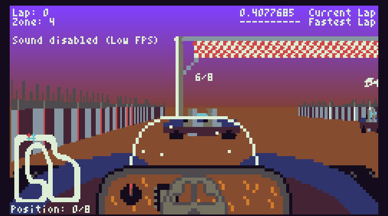

# Raycast Racer
Raycast Racer is a raycasting-based racing game, made for the [TIC-80 fantasy console](https://tic80.com/).

## Getting the game
You have the following options:

- Get it from [itch.io](https://github.com/nalquas/raycast-racer)
- Get it from [tic80.com](https://tic80.com/play?cart=693)
- Get it from [GitHub](https://github.com/nalquas/raycast-racer/releases)

## How to play
Raycast Racer is, rather obviously, a racing game.
Drive a a few laps around the track and try to finish in first place.

It is highly recommended you adjust your graphics settings if the game runs poorly, since performance heavily depends on your CPU.
Reducing scan resolution can deliver the most significant performance improvement.

## Controls
- Accelerate: Up (arrow key)
- Brake: Down (arrow key)
- Steer: Left/Right (arrow keys)
- Select in Menus: TIC-80's "A" button (normally Z on your keyboard)

## How to use development version
If you **don't** have TIC-80 Pro, please download the `.tic` cartridge in the GitHub release tab instead. The normal TIC-80 build can't open `.lua` formatted development cartridges. Alternatively, you should also be able to use a self-compiled version of TIC-80.

Assuming you have TIC-80 Pro installed, you can install the `.lua` dev cartridge like this:

- Run TIC-80 Pro
- Type `folder` to open your TIC-80 directory
- Copy `RaycastRacer.lua` into the folder
- Type `load RaycastRacer.lua`, then `run`
